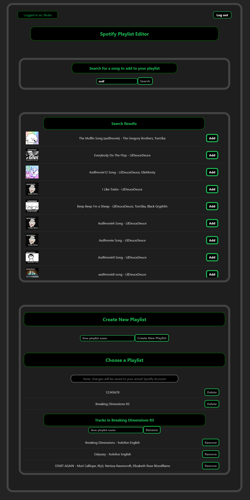

# React Spotify Playlist Editor

A React-based web application that allows you to manage your Spotify playlists. You can view your playlists, add or remove tracks, rename playlists, and search for songs to add—all with a Spotify-style interface.

---

## Features

- **Spotify Login:** Authenticate via Spotify OAuth with PKCE.
- **Playlist Management:** 
  - View all your playlists.
  - Select a playlist to see its tracks.
  - Rename playlists.
  - Delete playlists.
- **Track Management:** 
  - Add tracks to playlists via search.
  - Remove tracks from playlists.
- **Responsive Design:** Works on both desktop and mobile devices.
- **Spotify-themed UI:** Dark theme with green accents, similar to Spotify.

---

## Screenshots



---

## Getting Started

### Prerequisites

- Node.js (v18+ recommended)
- Spotify Developer Account
- Your own Spotify App with **Client ID** and **Redirect URI**

### Folder Strcture

ReactProj/
├─ src/
│  ├─ components/
│  │  ├─ LoginComp.jsx
│  │  ├─ PlayListComp.jsx
│  │  ├─ TrackListComp.jsx
│  │  ├─ SearchBarComp.jsx
│  │  ├─ PlayPreviewComp.jsx
│  │  └─ useSpotifyAuth.jsx
│  ├─ App.jsx
│  └─ main.css / component CSS files
├─ public/
│  └─ index.html
├─ package.json
├─ README.md
└─ .gitignore

### Installation

1. Clone the repository:

```bash
git clone https://github.com/YOUR_USERNAME/ReactSpotifyAPI.git

cd ReactSpotifyAPI/ReactProj

npm install
```
setup .env file or modify useSpotifyAuth.jsx directly:
REACT_APP_CLIENT_ID=your_spotify_client_id
REACT_APP_REDIRECT_URI=http://localhost:5173/

```bash
npm run dev
```